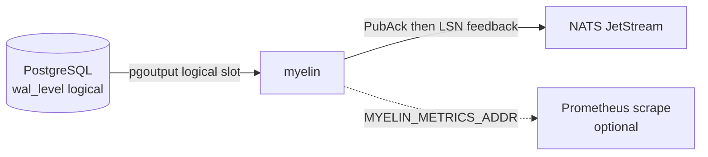

# myelin

[](https://github.com/YubinghanBai/myelin/actions/workflows/ci.yml)

Postgres **logical replication** (`pgoutput`) → **JSON envelopes** + optional **NATS JetStream** publish. Single Rust binary, at-least-once semantics (not exactly-once).

**Repository:** [github.com/YubinghanBai/myelin](https://github.com/YubinghanBai/myelin)

## Why “myelin”?

In biology, **myelin** is the fatty sheath wrapped around axons. It does not invent the nerve impulse — it **insulates** the fiber, **speeds** propagation (saltatory conduction), and helps the signal stay **clear and intact** at the synapse rather than leaking away as noise.

This project uses the same metaphor for data infrastructure: PostgreSQL already produces a disciplined stream of committed changes via logical replication; myelin is the **thin, fast layer** that **wraps** that stream, **carries** it efficiently to downstream systems (for example JetStream), and keeps **semantics explicit** — LSN boundaries, envelope shape, and at-least-once behavior — so consumers see a **clear signal**, not ambiguous raw replication noise.

Naming is intentional: not a second database, not a kitchen-sink platform — a **sheath** for replication, built for **low ceremony** and **honest** delivery guarantees.

## What it does

- Reads changes from a logical replication slot (publication must include your table(s)).
- Emits `insert` / `update` / `delete` envelopes with `lsn_hex`, table identity, and row payload (see `src/pg/pgoutput.rs`).
- With `NATS_URL` set: publishes to JetStream after **PubAck**, then advances applied LSN feedback (see `PLAN.md` / `src/pg/stream.rs` comments).
- Without `NATS_URL`: logs envelopes (`RUST_LOG=info,myelin::envelope=info`).
- Optional **Prometheus** scrape HTTP when `MYELIN_METRICS_ADDR` is set (e.g. `127.0.0.1:9095`).

## Architecture



## Requirements

- **Rust** toolchain ≥ `1.92` (see `Cargo.toml` `rust-version`).
- **PostgreSQL** with `wal_level=logical`, replication user, publication + slot (the binary can create slot/publication pieces via admin SQL; see `src/pg/admin.rs`).
- Optional: **NATS** with JetStream (`docker compose` includes NATS `-js`).

## Quick start (Docker)

```bash
docker compose up -d
export PGHOST=127.0.0.1 PGPORT=5432 PGUSER=postgres PGPASSWORD=postgres PGDATABASE=postgres
# Dry-run (log only)
cargo run --release
# JetStream
export NATS_URL=nats://127.0.0.1:4222
cargo run --release
```

Local E2E (Postgres + optional NATS):

```bash
./scripts/e2e_local.sh
USE_NATS=1 ./scripts/e2e_local.sh
```

Script phases (see header in `scripts/e2e_local.sh` and [`PLAN.md`](./PLAN.md)):

- **Phase 3** (`USE_NATS=1` only): oversized **`stall`** → non-zero exit + log error; **drain replay** with higher `MYELIN_MAX_PAYLOAD_BYTES`; **`dead_letter`** → DLQ notice and a follow-up row still published. Set **`E2E_PHASE3=0`** to skip.
- **Phase 6**: bulk INSERT → kill connector → restart → every bulk `correlation_id` appears in log (duplicates OK). Default **`E2E_BULK_ROWS=2000`**; **`E2E_PHASE6=0`** skips.

## Environment variables (common)

| Variable | Purpose |
|----------|---------|
| `PGHOST`, `PGPORT`, `PGUSER`, `PGPASSWORD`, `PGDATABASE` | Replication + admin |
| `PG_SLOT`, `PG_PUBLICATION` | Slot / publication name (defaults `myelin_slot` / `myelin_pub`) |
| `PG_TABLE` | Table ensured in publication (default `public.events`) |
| `PGADMIN_URL` | libpq conn string for DDL/admin (defaults from PG* vars) |
| `MYELIN_SKIP_SCHEMA` | If `1`, skip applying `schema/events.sql` |
| `NATS_URL` | If set, enable JetStream publisher |
| `NATS_STREAM`, `NATS_SUBJECT_PREFIX` | JetStream stream name / subject prefix |
| `MYELIN_MAX_PAYLOAD_BYTES` | Max serialized envelope size (default 768KiB) |
| `MYELIN_OVERSIZED_POLICY` | `stall` (default) or `dead_letter` |
| `MYELIN_DLQ_SUBJECT` | Dead-letter subject when policy is `dead_letter` |
| `MYELIN_LOG_ENVELOPE` | If `1`, log each JetStream publish (testing / debug) |
| `MYELIN_METRICS_ADDR` | If set (e.g. `127.0.0.1:9095`), expose Prometheus scrape HTTP (plaintext; bind carefully) |

### Observability

- **Structured tracing** (`target: myelin::replication`): per-chunk `xlog_data` / `commit` at **debug** — use `RUST_LOG=info,myelin::replication=debug` (or `trace`) for decode/publish detail without drowning unrelated crates.
- **Prometheus** (when `MYELIN_METRICS_ADDR` is set): counters and histograms include, among others:

| Metric (prefix) | Kind | Notes |
|-----------------|------|--------|
| `myelin_replication_events_total` | counter `{kind}` | `begin`, `commit`, `xlog_data`, `stopped` |
| `myelin_replication_last_commit_end_lsn_raw` | gauge | Raw `end_lsn` u64 from last Commit |
| `myelin_replication_last_xlog_wal_end_raw` | gauge | Raw `wal_end` from last successful `XLogData` chunk |
| `myelin_replication_xlog_chunk_bytes` | histogram | Incoming WAL payload size per chunk |
| `myelin_replication_xlog_chunk_process_seconds` | histogram | Time to decode + publish one chunk |
| `myelin_envelopes_materialized_total` | counter | Rows decoded to envelopes per chunk |
| `myelin_jetstream_publish_ack_total` | counter `{op}` | JetStream PubAck after publish |
| `myelin_oversize_dlq_total` | counter | Oversized rows sent as DLQ notice |

**Slot lag** is not computed inside myelin; correlate with Postgres ([ops checklist](#operations-checklist) below).

### Micro-benchmarks

Rust **Criterion** bench for envelope JSON serialization:

```bash
cargo bench --bench envelope_json
```

This does **not** replace end-to-end replication benchmarks; pair with `E2E_BULK_ROWS` / fixed PG+NATS versions for throughput stories ([`PLAN.md`](./PLAN.md)).

## Operations checklist

- **`wal_level=logical`** on the publisher (required for logical replication).
- **Dedicated replication user** with `REPLICATION` / minimal rights; protect `PGPASSWORD`.
- **Publication scope**: only tables that should emit CDC — avoids blowing WAL retention on accidental large tables.
- **Slot monitoring** (run as superuser / monitoring role on the primary):

  ```sql
  SELECT slot_name, active, restart_lsn, confirmed_flush_lsn,
         pg_size_pretty(pg_wal_lsn_diff(pg_current_wal_lsn(), restart_lsn)) AS wal_retained_approx
  FROM pg_replication_slots
  WHERE slot_name = 'myelin_slot';
  ```

  Alert on **large** `pg_wal_lsn_diff` vs your disk / ops policy (consumer behind).
- **`max_slot_wal_keep_size`** / **`wal_keep_size`**: cap how much WAL is kept for a lagging slot so the primary does not fill disk indefinitely (behavior: slot may become invalid if exceeded — tune with your RPO/RTO).
- **Downstream**: expect **at-least-once**; use business keys + `lsn_hex` (or equivalent) for idempotency.
- **Metrics listener**: scrape via loopback or place behind your mesh; see [`SECURITY.md`](./SECURITY.md).

## CI & contributing

GitHub Actions runs `cargo fmt`, `clippy -D warnings`, `cargo test`, and `cargo build --benches`. Docker-based E2E is optional locally (`scripts/e2e_local.sh`). Use [`.github/pull_request_template.md`](./.github/pull_request_template.md) and issue templates when opening PRs/issues.

## Docs

- Semantics and phased plan: [`PLAN.md`](./PLAN.md).
- Vulnerability reporting: [`SECURITY.md`](./SECURITY.md).

## License

MIT — see [`LICENSE`](./LICENSE).
