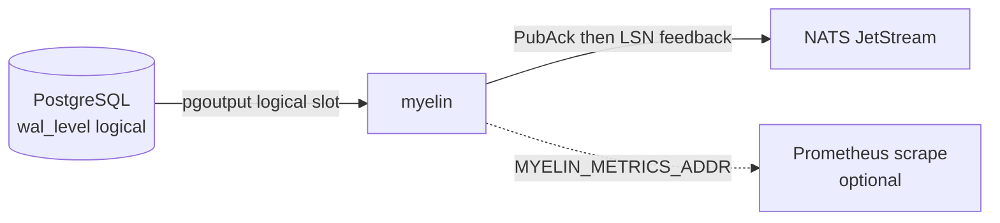

# myelin

[](./LICENSE)
[](./Cargo.toml)
[](https://github.com/YubinghanBai/myelin/actions/workflows/ci.yml)
[](https://github.com/YubinghanBai/myelin/actions/workflows/e2e.yml)

Postgres **logical replication** (`pgoutput`) → **JSON envelopes** + optional **NATS JetStream** publish. Single Rust binary, **at-least-once** delivery (not exactly-once).

## Why “myelin”?

In biology, **myelin** insulates axons so impulses propagate faster and arrive **clearly** at the synapse instead of leaking as noise.

Here, PostgreSQL already emits a disciplined stream of committed changes; myelin is a **thin layer** around that stream so downstream systems get **explicit** JSON (LSN, table, operation, row) instead of raw `pgoutput` noise.

## What it does

- Reads from a logical replication slot; your publication must include the table(s) you care about.
- For each change, emits a JSON **change envelope** (`insert` / `update` / `delete`) with `lsn_hex`, schema/table identity, and column map (see [Payload example](#payload-example)).
- With `NATS_URL`: publishes each envelope to JetStream after **PubAck**, then feeds LSN progress back to Postgres (see `src/pg/stream.rs` / `src/pg/publish.rs`).
- Without `NATS_URL`: logs envelopes (`RUST_LOG=info,myelin::envelope=info`).
- Optional **Prometheus** scrape endpoint when `MYELIN_METRICS_ADDR` is set.

## Payload example

JetStream messages (and log lines when not using NATS) use one JSON object per row change — the serialized [`ChangeEnvelope`](./src/pg/pgoutput.rs) (`serde_json` + `snake_case` keys).

**`insert`** on the default `public.events` table (illustrative IDs and timestamps):

```json
{
  "lsn_hex": "0/16F1BE8",
  "tx_xid": 742,
  "op": "insert",
  "schema": "public",
  "table": "events",
  "rel_id": 16385,
  "row": {
    "id": "550e8400-e29b-41d4-a716-446655440000",
    "correlation_id": "req-abc-1",
    "kind": "order_placed",
    "claim_uri": "s3://bucket/objects/claim-001",
    "claim_meta": { "bytes": 2048, "checksum": "sha256:…" },
    "created_at": "2026-03-30T12:34:56.789012+00:00"
  }
}
```

**`update`:** same top-level fields with `"op": "update"`. `row` is the **new** tuple. When Postgres sends an “old” or key tuple on the wire, Myelin adds **`old_row`** (same shape as `row`); otherwise `old_row` is omitted.

**`delete`:** `"op": "delete"`; **`row`** carries the deleted row (or replica-identity columns), per `pgoutput`.

**`tx_xid`:** present when the transaction id was seen on the replication stream; omitted when unknown (`null` is never written — the key is absent).

Subject routing uses `NATS_SUBJECT_PREFIX` + table identity; the **message payload** is the JSON above.

Downstream consumers should assume **at-least-once**: dedupe or idempotize with business keys and `lsn_hex` (and your own correlation fields).

## Architecture



## Requirements

- **Rust** ≥ `1.94` (`rust-version` in [`Cargo.toml`](./Cargo.toml)).
- **PostgreSQL** with `wal_level=logical`, replication user, publication + slot (admin helpers in `src/pg/admin.rs`).
- Optional: **NATS** with JetStream enabled (`docker compose` uses `-js`).

## Installation

This repo does **not** publish prebuilt binaries or a Docker image for **myelin** itself. Deploy by building from source (or wrapping the binary in your own image).

**Build release binary (clone or CI artifact layout):**

```bash
cargo build --release
# binary: target/release/myelin
```

**Install into your cargo bin path (from a checkout):**

```bash
cargo install --path .
# installs myelin from the current directory
```

**Dependencies only via Compose:** `docker compose` brings **Postgres** and **NATS** for local/dev use; it does not run the myelin container for you. For production, run `myelin` on VMs, Kubernetes, or a container you build (there is no official `docker pull …/myelin` yet).

## Quick start (Docker)

```bash
docker compose up -d
export PGHOST=127.0.0.1 PGPORT=5432 PGUSER=postgres PGPASSWORD=postgres PGDATABASE=postgres
# Log-only (no JetStream)
cargo run --release
# JetStream
export NATS_URL=nats://127.0.0.1:4222
cargo run --release
```

**Smoke E2E (optional):**

```bash
./scripts/e2e_local.sh
USE_NATS=1 ./scripts/e2e_local.sh
```

Phase-by-phase detail, CI matrix, and optional timing notes live in [`TESTING.md`](./TESTING.md).

## Environment variables (common)

| Variable | Purpose |
|----------|---------|
| `PGHOST`, `PGPORT`, `PGUSER`, `PGPASSWORD`, `PGDATABASE` | Replication + admin |
| `PG_SLOT`, `PG_PUBLICATION` | Slot / publication name (defaults `myelin_slot` / `myelin_pub`) |
| `PG_TABLE` | Table ensured in publication (default `public.events`) |
| `PGADMIN_URL` | libpq conn string for DDL/admin (defaults from PG* vars) |
| `MYELIN_SKIP_SCHEMA` | If `1`, skip applying `schema/events.sql` |
| `NATS_URL` | If set, enable JetStream publisher |
| `NATS_STREAM`, `NATS_SUBJECT_PREFIX` | JetStream stream name / subject prefix |
| `MYELIN_MAX_PAYLOAD_BYTES` | Max serialized envelope size (default 768KiB) |
| `MYELIN_OVERSIZED_POLICY` | `stall` (default) or `dead_letter` |
| `MYELIN_DLQ_SUBJECT` | Dead-letter subject when policy is `dead_letter` |
| `MYELIN_LOG_ENVELOPE` | If `1`, log each JetStream publish (testing / debug) |
| `MYELIN_METRICS_ADDR` | If set (e.g. `127.0.0.1:9095`), expose Prometheus scrape HTTP (plaintext; bind carefully) |
| `MYELIN_PUBLISH_MAX_ATTEMPTS` | JetStream publish + PubAck tries per message (default `8`, minimum `1`) |
| `MYELIN_PUBLISH_RETRY_INITIAL_MS` | First backoff after a failed publish/ack (default `100`) |
| `MYELIN_PUBLISH_RETRY_MAX_MS` | Backoff cap; doubles each retry (default `5000`) |

### Observability

- **Graceful shutdown:** **Ctrl+C** (SIGINT) or **SIGTERM** stops waiting after the **current** WAL handler finishes (in-flight decode + publish for an `XLogData` chunk, including JetStream retries, is not torn down mid-flight).
- **Tracing:** `target: myelin::replication` for per-chunk detail — e.g. `RUST_LOG=info,myelin::replication=debug`.
- **Prometheus** (when `MYELIN_METRICS_ADDR` is set):

| Metric (prefix) | Kind | Notes |
|-----------------|------|--------|
| `myelin_replication_events_total` | counter `{kind}` | `begin`, `commit`, `xlog_data`, `stopped` |
| `myelin_replication_last_commit_end_lsn_raw` | gauge | Raw `end_lsn` u64 from last Commit |
| `myelin_replication_last_xlog_wal_end_raw` | gauge | Raw `wal_end` from last successful `XLogData` chunk |
| `myelin_replication_xlog_chunk_bytes` | histogram | Incoming WAL payload size per chunk |
| `myelin_replication_xlog_chunk_process_seconds` | histogram | Time to decode + publish one chunk |
| `myelin_envelopes_materialized_total` | counter | Rows decoded to envelopes per chunk |
| `myelin_jetstream_publish_ack_total` | counter `{op}` | JetStream PubAck after publish |
| `myelin_oversize_dlq_total` | counter | Oversized rows sent as DLQ notice |
| `myelin_jetstream_publish_retries_total` | counter | Backoff retries after publish/PubAck failure |
| `myelin_shutdown_signals_total` | counter | SIGINT/SIGTERM graceful shutdown path taken |

Slot lag is computed in Postgres, not inside myelin — see [Operations checklist](#operations-checklist).

## Operations checklist

- **`wal_level=logical`** on the publisher.
- **Dedicated replication user** with `REPLICATION` and minimal rights; protect `PGPASSWORD`.
- **Publication scope:** only tables that should emit CDC.
- **Slot monitoring** (superuser / monitoring role):

  ```sql
  SELECT slot_name, active, restart_lsn, confirmed_flush_lsn,
         pg_size_pretty(pg_wal_lsn_diff(pg_current_wal_lsn(), restart_lsn)) AS wal_retained_approx
  FROM pg_replication_slots
  WHERE slot_name = 'myelin_slot';
  ```

- **`max_slot_wal_keep_size`** / **`wal_keep_size`:** cap WAL retained for lagging slots.
- **Downstream:** expect **at-least-once**; combine `lsn_hex` with your business keys for idempotency.
- **Metrics listener:** bind carefully; see [`SECURITY.md`](./SECURITY.md).

## CI & contributing

GitHub Actions: [`ci.yml`](./.github/workflows/ci.yml) (`fmt`, `clippy`, `test`, bench build) and [`e2e.yml`](./.github/workflows/e2e.yml) (slim JetStream + SIGTERM). E2E variants and local scripts: [`TESTING.md`](./TESTING.md).

Use [`.github/pull_request_template.md`](./.github/pull_request_template.md) and issue templates for PRs/issues.

## Docs

- Vulnerability reporting: [`SECURITY.md`](./SECURITY.md).

## License

MIT — see [`LICENSE`](./LICENSE).
